  

## 🌐 Connect With Me

## 🛠️ Tech Stack & Tools

### Languages

### Databases

### Tools & Platforms

  

##
<picture>
  <source media="(prefers-color-scheme: dark)" srcset="https://raw.githubusercontent.com/jattu8602/jattu8602/output/pacman-contribution-graph-dark.svg">
  <source media="(prefers-color-scheme: light)" srcset="https://raw.githubusercontent.com/jattu8602/jattu8602/output/pacman-contribution-graph.svg">
  
</picture>

##

